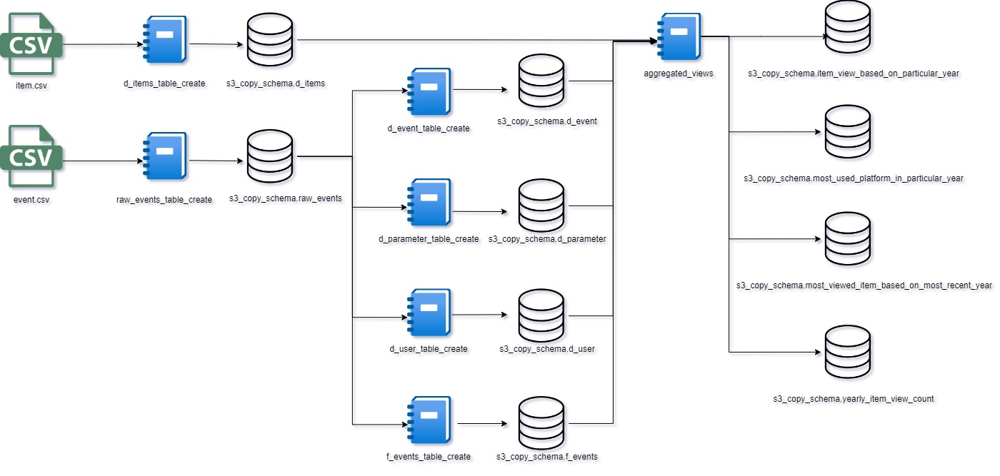
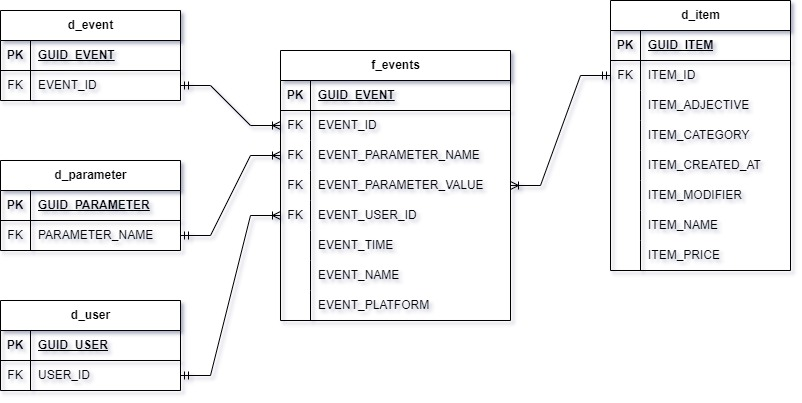

# Data engineering and ETL activites with S3 bucket (Cloud Storage) - Airflow (ETL) - Snowflake (Data Mart (Storage)) - Power BI (Visualization) on Marketing Data Sample
This Repo contains activities related to ETL, data mart creation and visualization. As tool S3-AIRFLOW-SNOWFLAKE and Power BI used

# Task Scenario:
A marketing and a sales team would like to delve into their retail store digital shop item view data browsed by users in order to see mostly viewed items, sales success of same items and measure digital shop platform preference of users.
Needed data will define company`s action plan to invest on mobile app or not and measure sales amount of items comparing with views of items.

Mainly, they would like to see 4 metric as below and consulted their data engineer to be able to accurately tracking those metrics;

  - What is the most used platform on item views among channels (web, mobile app etc.) in a yearly based as time period?
  - What is the yearly amount of item views on all platforms?
  - What is the most viewed item on recent year and how many times viewed? (In the latest year on dataset)
  - What are the item view amounts and view ranks as yearly distributed?

# Current State:
As learned by data architects of the company, online channels historical usage data resides on an AWS S3 storage location.
2 files mentioned as keeping requested data with belo metadata, mentioned files are being upserted in a daily schedule,

* items.csv consisting of below fields and creates source of truth for items; (Mentioned file can be found on files)
  * adjective : categorical value defines main function of a product (nullable)
  * category :  categorical value defines product category (not nullable)
  * created_at : date time value defines when product created at sales system (e.g SAP) (not nullable)
  * ID : unique id of a product (not nullable)
  * modifier : categorical value defines sub feature of a product (nullable)
  * name : product name being created by concat of adjective + category + modifier (not nullable)
  * price : product price (not nullable)
 
* event.csv consisting of below fields and creates source of truth for items; (Mentioned file can be found on files)
  * event_id :  unique id assigned by online apps for user actions (not nullable)
  * event_time : date time value of event (not nullable)
  * user_id : unique id of user who commit event action (not nullable)
  * event.payload :  JSON structured field consisting of nested fields 
    * event_name : event identifier (e.g view_item) (not nullable)
    * platform : platform where event takes place (e.g web, android) (not nullable)
    * parameter_name :  parameter used in event (e.g item_id) (not nullable)
    * parameter value : value of parameter used in the event (int value) (not nullable)

# Target State:
Based on current state definition, an ETL pipeline will be established to transform raw data in 2 csv files to establish a data model consisting of fact and dim tables that can give users opportunity to have their self service BI by PowerBI. 
Also, materialized views will be located on Snowflake and PowerBI will consume them which will provide exact & allways available answers of what business requires to learn.
Below on flow diagram demonstration of the solution will be implemented.

## Detailed Design of the solution

S3 Cloud Storage : As mentioned 2 csv files located on a storage endpoint. No further actions will be taken for storage

Airflow ETL Design : Below design shown on schema is used for ETL design. DAGS on airflow will get data from S3 location transform and load into database/schema in a daily scheduled manner. Trigger of DAGS will be done by themselves, which means first raw_data table DAG will run and trigger next one as a sequence, dims table DAGS will run following each other at last fact table dag will run and ETL cycle will be completed.

Almost all of the tables being refreshed by data delta loads with MERGE INTO command. Based on spesific keys transactions are updated (SCD-1) or new transactions are inserted. 
For example if an item`s price changes Items only related fields will be updated by new price value. 

Snowflake Database Design : Below data model will be created as result of ETL process. A fact and dim tables will be connected each other in one-many refential integrity. By this model users on PowerBI will have capability to create further analysis addition to requests defined.
Below is the E-R diagram of data model and shown tables gathered into PowerBI Desktop for further visualization works.

Data model imported into PBIX file

